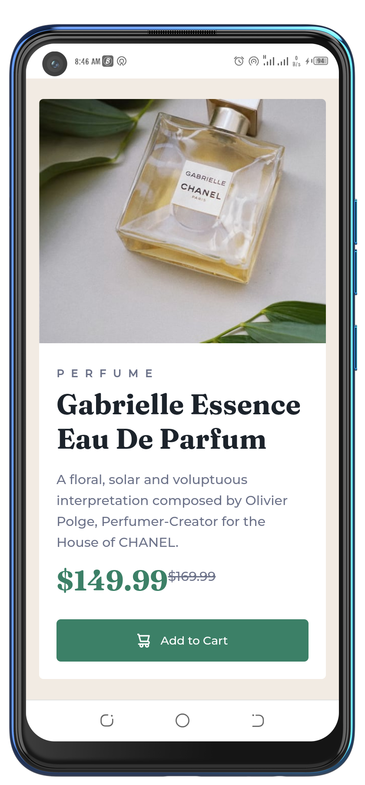
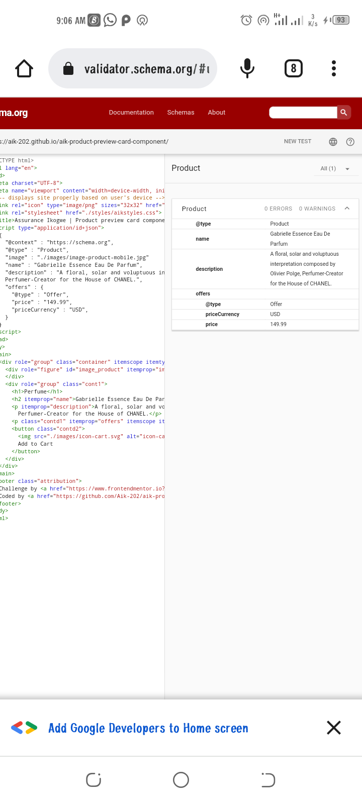

# Frontend Mentor - Product preview card component solution

This is a solution to the [Product preview card component challenge on Frontend Mentor](https://www.frontendmentor.io/challenges/product-preview-card-component-GO7UmttRfa). Frontend Mentor challenges help you improve your coding skills by building realistic projects. 

## Table of contents

- [Overview](#overview)
  - [The challenge](#the-challenge)
  - [Screenshot](#screenshot)
  - [Links](#links)
- [My process](#my-process)
  - [Built with](#built-with)
  - [What I learned](#what-i-learned)
  - [Continued development](#continued-development)
  - [Useful resources](#useful-resources)
- [Author](#author)


## Overview

### The challenge

Users should be able to:

- View the optimal layout depending on their device's screen size
- See hover and focus states for interactive elements

### Screenshot

.png)




### Links

- Solution URL: [Add solution URL here](https://your-solution-url.com)
- Live Site URL: [Add live site URL here](https://your-live-site-url.com)

## My process

### Built with

- Semantic HTML5 markup
- CSS Flex
- Mobile-first workflow
- HTML5 Microdata attributes like itemscope, itemprop e.t.c
- JSON.LD


### What I learned

I have long read about micro data, that is the data that tells search engines more about your page and how to structure them, but I was yet to implement my knowledge, until this project came along. So, in this project I learnt how to use HTML5 Microdata attributes like itemscope, itemprop e.t.c and JSON.LD to structure my page, I also learnt about some tools I can use to structure a page automatically and validate the structure of the page that is Google Structured Data Markup Helper and Schema Markup Validator respectively.

To see how you can add code snippets, see below:

```html
<div role="group" class="container" itemscope itemtype="https://schema.org/Product">
      <div role="figure" id="image_product" itemprop="image">
      </div>
      <div role="group" class="cont1">
        <h1>Perfume</h1>
        <h2 itemprop="name">Gabrielle Essence Eau De Parfum</h2>
        <p itemprop="description">A floral, solar and voluptuous interpretation composed by Olivier Polge,
          Perfumer-Creator for the House of CHANEL.</p>
        <p class="contd1" itemprop="offers" itemscope itemtype="https://schema.org/Offer"><span itemprop="priceCurrency" content="USD" >$</span><span itemprop="price">149.99</span><sup>$169.99</sup></p>
        <button class="contd2">
          
          Add to Cart
        </button>
      </div>
    </div>
```
```js
<script type="application/id+json">
    {
      "@context" : "https://schema.org",
      "@type" : "Product",
      "image" : "./images/image-product-mobile.jpg"
      "name" : "Gabrielle Essence Eau De Parfum",
      "description" : "A floral, solar and voluptuous interpretation composed by Olivier Polge,
      Perfumer-Creator for the House of CHANEL.",
      "offers" : {
        "@type" : "Offer",
        "price" : "149.99",
        "priceCurrency" : "USD",
      }
    }
  </script>
```

### Continued development

I wish to keep using HTML5 Microdata attributes like itemscope, itemprop e.t.c and JSON.LD to structure my pages, so that search engines can easily understand my page. 

### Useful resources

- [Example resource 1](https://www.example.com) - This helped me for XYZ reason. I really liked this pattern and will use it going forward.
- [Example resource 2](https://www.example.com) - This is an amazing article which helped me finally understand XYZ. I'd recommend it to anyone still learning this concept.
- https://developer.mozilla.org/en-US/docs/Web/HTML/Global_attributes/itemscope#browser_compatibility
- https://schema.org/docs/schemas.html
- https://www.geeksforgeeks.org/html-itemscope-attribute/amp/
- https://validator.schema.org/#url=https%3A%2F%2Faik-202.github.io%2Faik-product-preview-card-component%2F


## Author

- Github - [@Aik-202](https://github.com/Aik-202/)
- Frontend Mentor - [@Aik-202](https://www.frontendmentor.io/profile/Aik-202)
- Twitter - [@chiomaikogwe](https://www.twitter.com/chiomaikogwe)

**Note: Delete this note and add/remove/edit lines above based on what links you'd like to share.**
